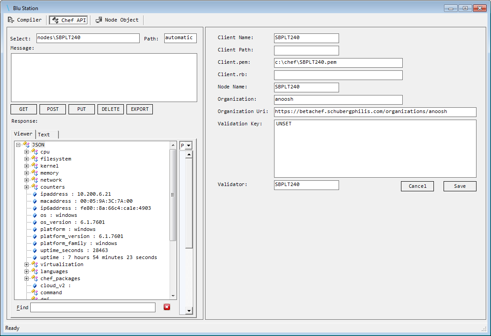
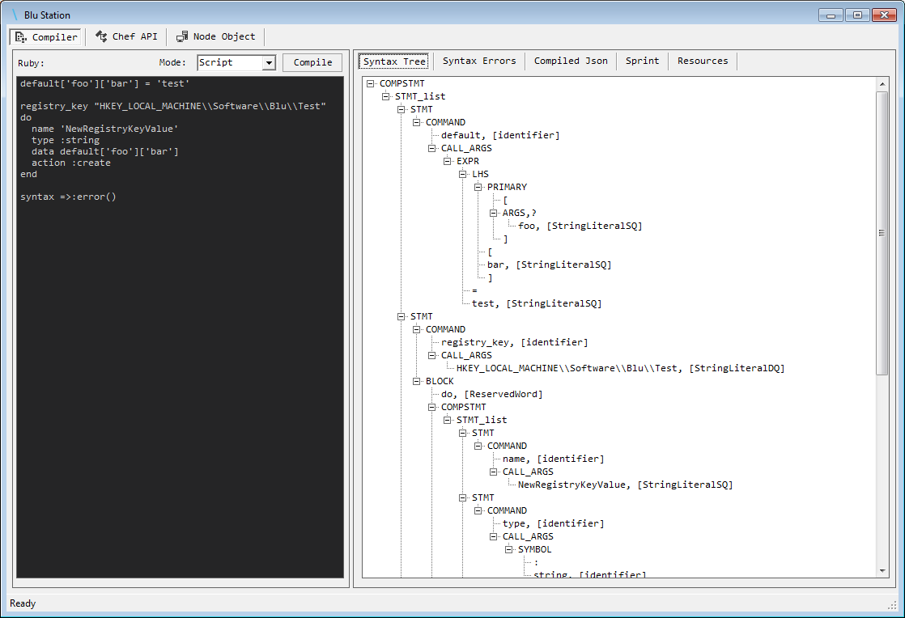

#########
BluStation
#########

****************
About BluStation
****************

**BluStation.dll** is currently an experimental library for Blu project which contains:

* A fully functional Chef API layer (BluApi.dll) written in C#
* A Chef DSL language transpiler to convert Ruby syntaxt to PowerShell (BluLang.dll)
* A GUI that can be started as a PowerShell CmdLet to interact wit BluApi and BluLang libraries in a graphical mode

.. note::
    Unlike Blu PowerShell Service which is meant for Chef Production use in a Windows environment; BluStation libraries are not production ready and are meant to provide building blocks for future projects. 
    Therefore it is provided AS IS with no guranatee that it would be useful for your specific use case.     

*******************************
Import BluStation to PowerShell
*******************************

Copy BluStation.sll into C:\\Blu folder and then import the module using::

    cd C:\Blu
    Import-Module .\BluStation.dll
    
To check if BluStation is loaded correctly, run::

	Get-Module

   
*******************
Connect to Chef API
*******************

To connect to Chef API use Connect-Chef CmdLet: 

Parameters::

    Connect-Chef 
        -Org <Chef Organization Uri>(Required)
        -Client <ClientName>(Required)
        -Node <NodeName>(Optional)
        
        -Validator <ValidatorName>(Optional)
        -KeyPath <drive:\path\to\validation_key.pem>(Optional)
        -Key <RSA key as string>(Optional)
        (either -Key or -Key file should be used and validated)
        
 
This CmdLet saves the configuration prvided by the above parameters to Windows registry in the below path::

    HKEY_LOCAL_MACHINE\SOFTWARE\Blu\Config

Example::

    Connect-Chef -Org https://chef.mycompany.com/organizations/myorganisation -Client Computer01 -KeyPath c:\chef\client.pem -Node Computer01

If all the configuration is ok, you will recieve a message as::

    14-03-2016 16:11:54 | OK    | Using Organization Name: myorganisation and Uri: https://chef.mycompany.com/organizations/myorganisation
    14-03-2016 16:11:54 | OK    | Using Client Name: Computer01
    14-03-2016 16:11:54 | OK    | Using Node Name: Computer01
    14-03-2016 16:11:54 | OK    | Using RSA Key : c:\chef\client.pem
    14-03-2016 16:11:54 | API   | Method : GET
    14-03-2016 16:11:54 | API   | Client : Computer01
    14-03-2016 16:11:54 | API   | organizationUri : https://chef.mycompany.com/organizations/myorganisation
    14-03-2016 16:11:54 | API   | resource : clients/Computer01
    14-03-2016 16:11:54 | API   | getUri : https://chef.mycompany.com/organizations/myorganisation/clients/Computer01
    14-03-2016 16:11:54 | API   | XOpsProtocol(Computer01, https://chef.mycompany.com/organizations/myorganisation/clients/Computer01);

     __          __    __
     \ \        / /_  / /_  __
      \ \      / __ \/ / / / /
       \ \    / /_/ / / /_/ /
        \_\  /_.___/_/\__,_/
    ═══════════════════════════════
    14-03-2016 16:11:54 | OK    | Connected!
    14-03-2016 16:11:54 | INFO  | Client Name: Computer01 / Organization: myorganisation
    14-03-2016 16:11:54 | API   | Method : GET
    14-03-2016 16:11:54 | API   | Client : Computer01
    14-03-2016 16:11:54 | API   | organizationUri : https://chef.mycompany.com/organizations/myorganisation
    14-03-2016 16:11:54 | API   | resource : nodes/Computer01
    14-03-2016 16:11:54 | API   | getUri : https://chef.mycompany.com/organizations/myorganisation/nodes/Computer01
    14-03-2016 16:11:54 | API   | XOpsProtocol(Computer01, https://chef.mycompany.com/organizations/myorganisation/nodes/Computer01);
    14-03-2016 16:11:55 | OK    | Recieved Node json for: Computer01

.. note::
    You can take a look at "HKEY_LOCAL_MACHINE\\SOFTWARE\\Blu\\Config" and check if all the configuration are correct. You can also delete this key to let Connect-Chef CmdLet recreate it. 
    This key is the only place where ChefAPI library is looking for connection settings. Files like client.rb and other Chef system files are not used by .Net Chef API client.     

**************
Using Chef API
**************
Access to Chef API from PowerShell namespace is provided by **Use-ChefApi** CmdLet:

Parameters::

    Use-ChefAPI 
        -Select <Chef endpoint>(Optional)
        -Path <Api Path>(Optional)
        -Node <NodeName>(Optional)
        -Format <data format>(optional) [json, dictionary]
        
In this example we request the number of CPUs for Computer01 from Ohai data::

    Use-ChefAPI -Select nodes/SBPLT240 -Path automatic/cpu/total
    

.. warning::

    Blu Chef API is a functional API client. That means API calls like "delete" or "post" are working as they meant to be. 
    If you delete an object by Blu Chef API, it really gets deleted from the Chef server, so you need to use Blu Chef API with the same cautions as other Chef API clients.  

****************************
API Graphical User Interface
****************************

To start the Chef API graphical user interface, use Show-UI CmdLet without any parameters::

    Show-UI

This UI provides a configurable GUI to Chef API (all configuration are saved and loaded from the same registry key) and an interface to experimental DSL transpiler. 

Screenshots:
------------

**Chef API interface:**

**Transpiler interface:**

